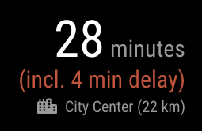

# MMM-TomTomCalculateRouteTraffic

[MagicMirror²](https://github.com/MichMich/MagicMirror/) module to calculate routes with TomTom API (free), and display travel time with traffic delays.



## Installation

1. Navigate to the `MagicMirror/modules` directory.
2. Execute `git clone https://github.com/teemoo7/MMM-TomTomCalculateRouteTraffic.git`
3. Configure the module with your routes as per below
4. Restart MagicMirror

## Usage

To use this module, add the following configuration block to the modules array in the `config/config.js` file:
```js
modules: [
  {
    module: "MMM-TomTomCalculateRouteTraffic",
    position: "top_right",
    header: "TomTom Calculated Routes",
    config: {
      apiTomTomKey: "<YOUR_API_KEY_HERE>",
      refresh: (5 * 60 * 1000), // in milliseconds
      animationSpeed: 2000, // in milliseconds
      routes: [{
        name: "Lausanne City Center",
        symbol: "city",
        from: {latitude: 46.4510653, longitude: 6.8192693},
        to: {latitude: 46.5287271, longitude: 6.652336}
      }, {
        name: "Zermatt chalet",
        symbol: "mountain",
        from: {latitude: 46.4510653, longitude: 6.8192693},
        to: {latitude: 45.9904832, longitude: 7.6594364}
      }]
    }
  },
]
```

## Configuration

### Options

| Field             | Required | Description                                               | Default                       |
|-------------------|----------|-----------------------------------------------------------|-------------------------------|
| `apiTomTomKey`    | `true`   | Your API key for TomTom API                               |                               |
| `routes `         | `true`   | Routes definition, with an array. See `route` specs below |                               |
| `refresh `        | `false`  | Refresh interval (in milliseconds)                        | `(5 * 60 * 1000)` (5 minutes) |
| `animationSpeed ` | `false`  | Animation time to display results (in milliseconds)       | `2000`                        |

### `route` specs

| Field     | Required | Description                                                            |
|-----------|----------|------------------------------------------------------------------------|
| `name`    | `true`   | Any name to identify the route                                         |
| `symbol ` | `false`  | A symbol name, from [Font Awesome icons](http://fontawesome.io/icons/) |
| `from `   | `true`   | Starting position, see `position` specs below                          |
| `to `     | `true`   | Destination position, see `position` specs below                       |

### `position` specs

| Field        | Required | Description          |
|--------------|----------|----------------------|
| `latitude`   | `true`   | Latitude coordinate  |
| `longitude ` | `true`   | Longitude coordinate |

## TomTom routing API

Relies on [TomTom routing API Calculate Route v1](https://developer.tomtom.com/routing-api/documentation/routing/calculate-route).

Note that contrary to many services like Google, **TomTom provides free APIs that can be used without credit card or any billing info**, with a reasonable **daily limit set to 2500 calls**.

To get an API key, just [create a developer account](https://developer.tomtom.com/user/register) and go to your [API & SDK keys](https://developer.tomtom.com/user/me/apps) page.
